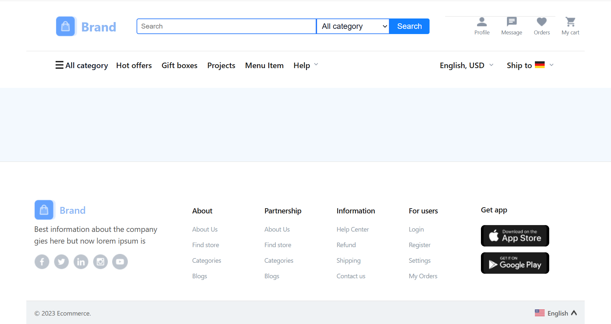

# 🛍️ E-Commerce Website – Week 1 & Week 2

## 📌 Overview
This project is part of the frontend development practice series, where we replicate a given **Figma design** into a fully responsive and pixel-perfect website using **HTML & CSS**.  
The focus is on understanding the design system, creating reusable components, and implementing accurate layouts for desktop screens.

---

## 📅 Week 1: Understanding the Design & Building the Layout

### 🎯 Goal
Familiarize with the provided **Figma design** and implement the **basic structure** of the website using HTML and CSS.

### 🛠️ Tasks
- Analyze the Figma file and extract **desktop layouts** for all pages.
- Set up the **project structure** with folders for:
  - HTML
  - CSS
  - Images/Assets
- Implement:
  - **Header**: Navigation bar with logo, search bar, and menu options.
  - **Footer**: All links and styling as per design.
- Focus on **accurate spacing, typography, and alignment** as shown in the Figma design.

### 📦 Deliverables
- Fully functional and visually accurate **header and footer sections**.
- Code pushed to a **GitHub repository**.

## 📹 Project Demo

---

## 📅 Week 2: Home Page & Product Listing Page

### 🎯 Goal
Build the **home page** and **product listing page** using the desktop layout from Figma.

### 🛠️ Tasks

#### 🏠 Home Page:
- Hero section with **banner** and **call-to-action buttons**.
- Featured **product categories** or promotional sections.

#### 🛍️ Product Listing Page:
- Grid-based **product cards** (image, name, price, and a “Buy Now” button).
- **Pagination** or "Load More" button at the bottom.
- Use **CSS Grid/Flexbox** for layout and ensure **pixel-perfect** implementation.
- Add **hover effects** for interactive elements like buttons or product cards.

### 📦 Deliverables
- Complete **home page** and **product listing page** with all sections styled.
- Code committed to **GitHub repository**.

---

## 📹 Project Demo
🎥 **Watch the Demo Video:** [![📺 Watch the demo]](Week_02/week2-preview/week2-preview.mp4)

---

## 💻 Technologies Used
- HTML5  
- CSS3 (Flexbox & Grid)  
- Figma (Design Reference)  

---

## ✨ Features
- Pixel-perfect design matching Figma layout.
- Fully styled **header & footer**.
- Interactive hover effects.
- Product grid with pagination.

---

# E-commerce Frontend Design - Week 3

## 📅 Week 3: Product Details Page and Interactivity

**Goal:**  
Create the **Product Details Page** and add basic interactivity using JavaScript.

---

## 📌 Tasks

### 1️⃣ Product Details Page
- Display **product image**, **description**, **price**, and **"Add to Cart"** button.
- Include a **Customer Reviews** or **Related Products** section for better user engagement.

### 2️⃣ Basic Interactivity
- Add a **dropdown menu** for selecting product sizes (if applicable).
- Implement a **JavaScript-based search bar** in the header (non-functional, styled only).

### 3️⃣ Testing
- Ensure visual **consistency across all pages**.
- Test compatibility with **major desktop browsers**.

---

## 📦 Deliverables
- Fully implemented **Product Details Page**.
- Styled and functional **interactive elements**.
- Final code uploaded to the GitHub repository.

---

## 🎥 Project Demo

[![📺 Watch Demo Video]](Week_03/week3-preview.zip/week3-preview.mp4)

if not found by the link you may download the file for better visualization 

*(The video demonstrates the Week 3 Product Details Page and interactivity in action)*

---

## 🛠️ Technologies Used
- **HTML5**
- **CSS3** (Flexbox & Grid)
- **JavaScript** (Basic DOM manipulation)
- **Figma** (Design reference)

---

## 🗂️ Folder Structure
ecommerce-frontend-design/
│
├── Week_01/
│     ├── index.html
│     ├── css/
|     |     └── Style.css
|     ├── assets/
|     |     └── images/
│     ├── week01_preview
|
├── Week_02/
│     ├── homepage.html
|     ├── Product-listing.html
|     ├── css/
│     |      └── style.css
│     ├── assets/
|     ├── week2-preview/
|                      └── week2-preview.mp4
|
├── Week-03/
│     ├── homepage.html
│     ├── product-listing.html
|     ├── product-detail-page.html
|     ├── css/
|            └── style.css
|     ├── assets/
|     ├── week3-preview/
|                      └── week3-preview.mp4
|
└── README.md

---

## 📌 Author 
GitHub: [YourProfileLink](https://github.com/laibashfaq)  
